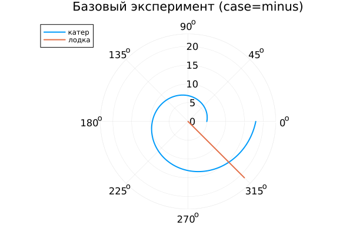

---
## Author
author:
  name: Заур Мустафаев
  email: 1132231443@rudn.ru
  affiliation:
    - name: Российский университет дружбы народов
      country: Российская Федерация
      postal-code: 117198
      city: Москва
      address: ул. Миклухо-Маклая, д. 6

## Title
title: "Математическое моделирование"
subtitle: "Лабораторная работа № 2"
license: "CC BY"
---

# Цель работы

Рассмотреть построение математической модели задачи преследования и на её основе определить рациональную стратегию движения преследующего объекта.  

В качестве иллюстрации анализируется ситуация погони: катер береговой охраны обнаруживает в тумане лодку браконьеров на расстоянии $k$ км. После обнаружения лодка вновь скрывается и продолжает движение по прямой в неизвестном направлении. Известно, что скорость катера превышает скорость лодки в $n$ раз.  

Требуется определить такую траекторию движения катера, которая гарантирует перехват лодки.

# Задание

1. Обосновать модель и вывести систему дифференциальных уравнений при условии, что скорость катера в $n$ раз больше скорости лодки.
2. Построить траектории движения объектов для двух вариантов начальных условий.
3. Определить по графикам точку их встречи.

# Выполнение лабораторной работы

Положим $t_0 = 0$.  
В момент обнаружения лодки примем её положение за начало координат: $x_0 = 0$.  
Катер в этот момент находится на расстоянии $k$ от лодки.

Переходим к полярной системе координат. Полюс совпадает с точкой обнаружения лодки, а полярная ось направлена в сторону начального положения катера.

## Определение начального радиуса

Пусть через некоторое время $t$ оба объекта окажутся на одинаковом расстоянии $x$ от полюса. За это время лодка пройдёт путь $x$, а катер — либо $x + k$, либо $x - k$ (в зависимости от взаимного расположения).

Поскольку время движения совпадает, получаем:

- для первого случая:
  
  $$
  \frac{x}{v} = \frac{x + k}{n v}
  $$

- для второго случая:
  
  $$
  \frac{x}{v} = \frac{x - k}{n v}
  $$

Решая эти уравнения, находим начальные радиусы:

$$
x_1 = \frac{k}{n + 1}, \quad \theta = 0
$$

$$
x_2 = \frac{k}{n - 1}, \quad \theta = -\pi
$$

## Построение дифференциальной модели

После достижения одинакового расстояния от полюса катер должен двигаться так, чтобы сохранять радиальную скорость, равную скорости лодки.

Разложим скорость катера на составляющие:

- радиальная скорость  
  $$
  v_r = \frac{dr}{dt}
  $$

- тангенциальная скорость  
  $$
  v_\tau = r \frac{d\theta}{dt}
  $$

Полная скорость катера равна $n v$. По теореме Пифагора:

$$
(nv)^2 = v_r^2 + v_\tau^2
$$

Так как $v_r = v$, получаем:

$$
v_\tau = v \sqrt{n^2 - 1}
$$

Следовательно,

$$
r \frac{d\theta}{dt} = v \sqrt{n^2 - 1}
$$

И система уравнений принимает вид:

$$
\begin{cases}
\frac{dr}{dt} = v, \\
r \frac{d\theta}{dt} = v \sqrt{n^2 - 1}.
\end{cases}
$$

Начальные условия:

**Первый случай**
$$
\begin{cases}
r_0 = \frac{k}{n+1}, \\
\theta_0 = 0
\end{cases}
$$

**Второй случай**
$$
\begin{cases}
r_0 = \frac{k}{n-1}, \\
\theta_0 = -\pi
\end{cases}
$$

Исключая время $t$, получаем уравнение:

$$
\frac{dr}{d\theta} = \frac{r}{\sqrt{n^2 - 1}}
$$

Решение данного уравнения описывает траекторию катера в полярных координатах.

## Условие численного эксперимента

Катер обнаруживает лодку на расстоянии $k = 20$ км.  
Отношение скоростей равно $n = 5$.

Для моделирования использовались внешние программные модули:





# Анализ результатов моделирования

Численное решение уравнения

$$
\frac{dr}{d\theta} = \frac{r}{\sqrt{n^2 - 1}}
$$

позволило исследовать характер движения катера и сопоставить его с прямолинейной траекторией лодки.

# Базовые эксперименты

## 1. Режим case = plus

Траектория катера имеет форму расходящейся спирали. Радиус возрастает при увеличении угла $\theta$, причём скорость роста пропорциональна текущему значению $r$, что приводит к экспоненциальному характеру зависимости.

Лодка движется по прямой линии. В полярной системе её движение задаётся линейной зависимостью радиуса от параметра.

Наблюдается устойчивое опережение катера по радиальному удалению.

## 2. Режим case = minus

Во втором варианте начальный радиус больше, поэтому вся спираль смещена наружу.  

Геометрическая форма траектории остаётся прежней, меняется только масштаб.

# Параметрическое исследование по $n$

Из уравнения следует, что коэффициент при $r$ равен

$$
\frac{1}{\sqrt{n^2 - 1}}
$$

При увеличении $n$:

- коэффициент уменьшается;
- рост радиуса замедляется;
- спираль становится менее крутой.

На графике видно, что при $n=3$ наблюдается наиболее быстрое расхождение, а при $n=10$ — наиболее плавное.

# Анализ метрики scale_ratio

Введена характеристика

$$
\text{scale\_ratio} = \frac{r_{\text{final}}}{\max(r_{\text{boat}})}
$$

Она отражает относительный масштаб траектории катера по сравнению с лодкой.

Результаты показывают:

- при малых $n$ катер значительно превосходит лодку по радиальному росту;
- с ростом $n$ различие уменьшается;
- для больших $n$ масштабы становятся сопоставимыми.

В режиме case=minus значения больше из-за увеличенного начального радиуса.

# Время вычислений

Численный анализ показал:

- время решения порядка $6 \times 10^{-4}$ с;
- зависимость от $n$ практически отсутствует;
- небольшие колебания связаны с особенностями численного интегрирования.

# Выводы

1. Движение катера описывается экспоненциально расходящейся спиралью.
2. Параметр $n$ определяет интенсивность радиального роста.
3. Начальные условия влияют на масштаб, но не на форму траектории.
4. Численное решение устойчиво и требует незначительных вычислительных затрат.

Полученные численные результаты согласуются с аналитическим решением дифференциального уравнения.

# Список литературы {.unnumbered}

1. [Задача о погоне](https://esystem.rudn.ru/pluginfile.php/2290141/mod_resource/content/2/Лабораторная%20работа%20№%201.pdf)
