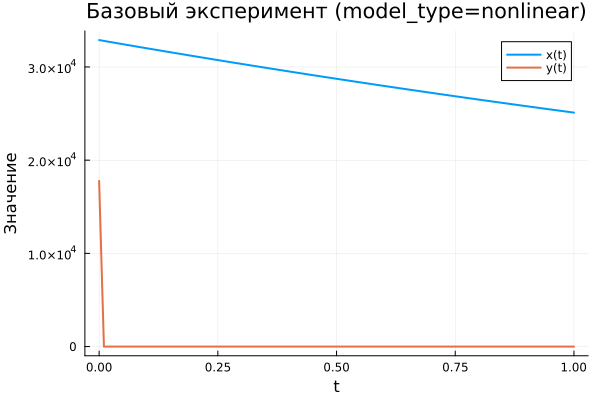
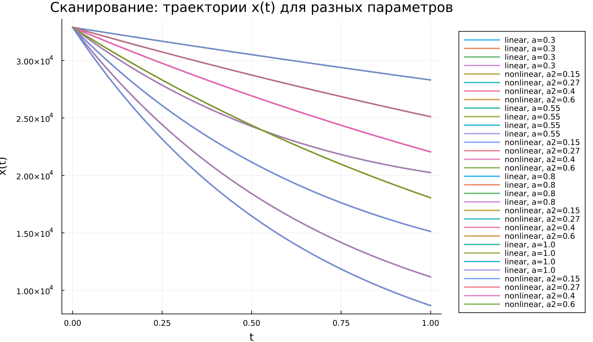

---
## Author
author:
  name: Заур Мустафаев
  email: 1132231443@rudn.ru
  affiliation:
    - name: Российский университет дружбы народов
      country: Российская Федерация
      postal-code: 117198
      city: Москва
      address: ул. Миклухо-Маклая, д. 6

## Title
title: "Математическое моделирование"
subtitle: "Лабораторная работа № 3"
license: "CC BY"
date: today
date-format: "YYYY-MM-DD"
---

# Введение

## Цель работы

Исследовать модели боевых действий Ланчестера и проанализировать изменение численности войск при различных вариантах вооружённого противостояния.

## Задачи исследования

1. Рассмотреть три основных варианта моделей Ланчестера.
2. Выполнить построение графиков изменения численности войск.
3. Проанализировать динамику решений и установить сторону, получающую преимущество.

# Теоретическая часть

## Основная идея моделей Ланчестера

В модели участвуют две противоборствующие стороны, численности которых задаются функциями

$$
x(t), \quad y(t)
$$

Если для одной из сторон в некоторый момент времени выполняется условие обращения численности в нуль, то данная сторона считается потерпевшей поражение.

## Случай 1: регулярные войска против регулярных войск

Для двух регулярных армий система имеет вид

$$
\begin{cases}
\frac{dx}{dt}= -a(t)x(t) - b(t)y(t) + P(t) \\
\frac{dy}{dt}= -c(t)x(t) - h(t)y(t) + Q(t)
\end{cases}
$$

Модель учитывает следующие факторы:

- потери, не связанные непосредственно с боем;
- боевые потери от действий противника;
- поступление подкреплений.

## Случай 2: регулярные войска против партизанских формирований

При участии нерегулярных сил потери партизан зависят как от численности армии противника, так и от их собственной численности:

$$
\begin{cases}
\frac{dx}{dt}= -a(t)x(t) - b(t)y(t) + P(t) \\
\frac{dy}{dt}= -c(t)x(t)y(t) - h(t)y(t) + Q(t)
\end{cases}
$$

## Случай 3: партизанские формирования против партизанских формирований

В случае столкновения двух нерегулярных сторон модель записывается так:

$$
\begin{cases}
\frac{dx}{dt}= -a(t)x(t) - b(t)x(t)y(t) + P(t) \\
\frac{dy}{dt}= -h(t)y(t) - c(t)x(t)y(t) + Q(t)
\end{cases}
$$

# Упрощённые модели

## Жёсткая модель для регулярных армий

Если не учитывать подкрепления и небоевые потери, система принимает вид

$$
\begin{cases}
\frac{dx}{dt}= -by \\
\frac{dy}{dt}= -ax
\end{cases}
$$

Для этой системы существует точное аналитическое решение, а фазовые траектории имеют вид гипербол.

## Качественная интерпретация

Результат противоборства определяется не только начальными численностями армий, но и интенсивностью поражающего воздействия.

Из анализа модели следует:

- численное превосходство даёт существенное преимущество;
- для компенсации превосходства противника необходимо значительно увеличивать боевую эффективность.

# Постановка задачи

## Исходные данные

Рассматривается конфликт между страной $X$ и страной $Y$.

Начальные численности войск заданы условиями

$$
x(0)=32888, \qquad y(0)=17777
$$

Необходимо исследовать изменение численности армий для двух вариантов модели.

## Случай 1: линейная модель

$$
\begin{cases}
\frac{dx}{dt}= -0.55x(t) - 0.77y(t) + 1.5\sin(3t+1) \\
\frac{dy}{dt}= -0.66x(t) - 0.44y(t) + 1.2\cos(t+1)
\end{cases}
$$

## Случай 2: нелинейная модель

$$
\begin{cases}
\frac{dx}{dt}= -0.27x(t) - 0.88y(t) + \sin(20t) \\
\frac{dy}{dt}= -0.68x(t)y(t) - 0.37y(t) + \cos(10t)
\end{cases}
$$

# Численный эксперимент

## Базовый эксперимент: линейная модель

## Базовый эксперимент: линейная модель

По результатам моделирования можно отметить следующее:

- обе функции убывают с течением времени;
- переменная $x(t)$ уменьшается плавно и без резких скачков;
- функция $y(t)$ снижается быстрее и к концу интервала становится близкой к нулю;
- поведение решения остаётся устойчивым и предсказуемым.

## Базовый эксперимент: нелинейная модель

## Базовый эксперимент: нелинейная модель

Для нелинейной системы наблюдаются иные особенности:

- функция $x(t)$ уменьшается медленнее, чем в линейном варианте;
- переменная $y(t)$ резко падает почти до нуля уже на начальном участке;
- дальнейшая эволюция системы определяется в основном функцией $x(t)$;
- нелинейные слагаемые заметно усиливают затухание.

# Параметрическое исследование

## Сканирование траекторий $x(t)$

## Сканирование траекторий $x(t)$

При изменении параметра модели были получены следующие результаты:

- с ростом параметра скорость убывания $x(t)$ возрастает;
- траектории становятся более крутыми;
- различия между решениями особенно хорошо заметны в средней и конечной частях интервала интегрирования.

## Сканирование траекторий $y(t)$

## Сканирование траекторий $y(t)$

Анализ графиков показывает, что

- в линейной модели увеличение параметра ускоряет уменьшение $y(t)$;
- в нелинейной модели $y(t)$ почти сразу стремится к нулю независимо от изменения параметра;
- нелинейные взаимодействия оказывают определяющее влияние на поведение системы.

# Вычислительные затраты

## Время вычислений

## Время вычислений

Сравнение временных затрат показало:

- линейная система решается быстрее;
- для линейной модели время вычисления имеет порядок $10^{-5}$ сек;
- для нелинейного случая оно находится на уровне $10^{-4}$–$10^{-3}$ сек;
- даже в более сложной постановке вычислительная стоимость остаётся низкой.

# Анализ итоговой характеристики

## Метрика norm_final

В качестве итогового показателя использовалась величина

$$
\text{norm\_final}=\sqrt{x(t_{final})^2 + y(t_{final})^2}
$$

Данная метрика описывает состояние системы в финальный момент моделирования.

## Зависимость norm_final от параметра

## Интерпретация полученных результатов

По графику можно сделать следующие выводы:

- при увеличении параметра итоговая метрика уменьшается;
- линейная модель быстрее приближается к состоянию покоя;
- нелинейная система дольше сохраняет ненулевое состояние;
- это связано с более медленным затуханием функции $x(t)$.

# Заключение

## Выводы

1. Линейная модель демонстрирует плавное, устойчивое и предсказуемое уменьшение обеих переменных.
2. В нелинейной системе функция $y(t)$ практически сразу обращается в нуль.
3. Изменение параметров существенно влияет на скорость убывания решений.
4. В линейной модели влияние параметров проявляется более явно.
5. Нелинейная система требует больших вычислительных затрат, однако они остаются незначительными.
6. Метрика $\text{norm\_final}$ уменьшается при увеличении параметра, что подтверждает усиление затухания динамики.

# Список литературы

1. Законы Осипова — Ланчестера.
2. Дифференциальные уравнения динамики боя.
3. Элементарные модели боя.
