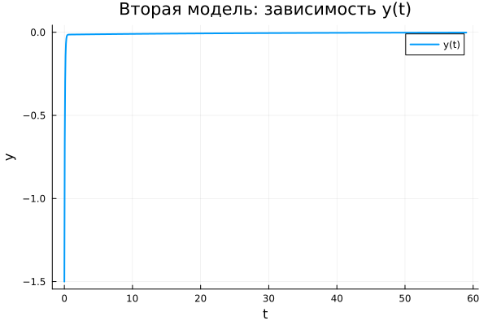

---
## Author
author:
  name: Заур Мустафаев
  email: 1132231443@rudn.ru
  affiliation:
    - name: Российский университет дружбы народов
      country: Российская Федерация
      postal-code: 117198
      city: Москва
      address: ул. Миклухо-Маклая, д. 6

## Title
title: "Математическое моделирование"
subtitle: "Лабораторная работа № 4"
license: "CC BY"
---

# Цель работы

Исследовать поведение гармонического осциллятора и его математическое описание.

# Задание

1. Получить и проанализировать решение уравнения гармонического осциллятора без учета затухания  
2. Сформулировать уравнение свободных затухающих колебаний, найти решение и построить фазовый портрет  
3. Исследовать модель с внешним воздействием, определить решение и соответствующий фазовый портрет  

# Выполнение лабораторной работы

## Теоретические сведения

Колебательные процессы различной природы — механические, электрические и другие — во многих случаях описываются единым дифференциальным уравнением. Такая универсальная модель называется линейным гармоническим осциллятором.

Общее уравнение движения имеет вид:
$$
\ddot{x} + 2\gamma \dot{x} + \omega_0^2 x = 0
$$

Здесь $x$ характеризует состояние системы (например, координату или заряд), $\gamma$ отражает интенсивность потерь энергии, а $\omega_0$ задаёт собственную частоту.

При отсутствии диссипативных эффектов ($\gamma = 0$) система становится консервативной:
$$
\ddot{x} + \omega_0^2 x = 0
$$

Для однозначного решения необходимо задать начальные условия:
$$
\begin{cases}
x(t_0) = x_0 \\
\dot{x}(t_0) = y_0
\end{cases}
$$

Переход к системе первого порядка осуществляется следующим образом:
$$
\begin{cases}
\dot{x} = y \\
\dot{y} = -\omega_0^2 x
\end{cases}
$$

Соответствующие начальные условия:
$$
\begin{cases}
x(t_0) = x_0 \\
y(t_0) = y_0
\end{cases}
$$

Переменные $x$ и $y$ образуют фазовое пространство системы. Каждому решению соответствует траектория на фазовой плоскости. Совокупность таких траекторий формирует фазовый портрет, позволяющий оценить динамику системы при различных начальных условиях.

## Задача

Требуется построить решения и фазовые портреты для следующих моделей:

1. Без затухания и без внешнего воздействия  
   $$
   \ddot{x} + 5.2x = 0
   $$

2. С затуханием без внешнего воздействия  
   $$
   \ddot{x} + 14\dot{x} + 0.5x = 0
   $$

3. С затуханием и внешней силой  
   $$
   \ddot{x} + 13\dot{x} + 0.3x = 0.8 \sin(9t)
   $$

Параметры моделирования: $t \in [0;59]$, шаг $0.05$, $x_0 = 0.5$, $y_0 = -1.5$

### Преобразование уравнений

1. Без затухания:
$$
\begin{cases}
\dot{x} = y \\
\dot{y} = -\omega_0^2 x
\end{cases}
$$

2. С затуханием:
$$
\begin{cases}
\dot{x} = y \\
\dot{y} = -2\gamma y - \omega_0^2 x
\end{cases}
$$

3. С внешней силой:
$$
\begin{cases}
\dot{x} = y \\
\dot{y} = F(t) - 2\gamma y - \omega_0^2 x
\end{cases}
$$

Для численного моделирования использовались внешние программные модули:





## Базовые эксперименты

### Первая модель (model_type = model1)

График $y(t)$ демонстрирует устойчивые периодические колебания с неизменной амплитудой. Кривая сохраняет регулярную форму на всём временном интервале.

Такая динамика характерна для системы без потерь энергии. Колебания не затухают, а энергия полностью сохраняется.

Фазовый портрет представляет собой замкнутую кривую, что указывает на повторяемость движения и его устойчивость.

Следовательно, модель описывает идеальные незатухающие колебания.

### Вторая модель (model_type = model2)

Во второй модели наблюдается быстрое уменьшение амплитуды. Переменная $y(t)$ стремится к нулю уже на начальном этапе.

Причиной является наличие демпфирующего члена, который приводит к рассеянию энергии.

Фазовая траектория быстро сжимается к точке равновесия, что соответствует затухающему процессу.

Таким образом, система демонстрирует переход к покою без колебательного режима.

### Третья модель (model_type = model3)

При наличии внешней силы система после переходного процесса выходит на режим установившихся колебаний.

Функция $y(t)$ не стремится к нулю, а колеблется с небольшой амплитудой.

Это связано с тем, что внешнее воздействие компенсирует потери энергии.

Фазовый портрет представляет собой ограниченную область около равновесия, что соответствует вынужденным колебаниям.

## Параметрическое сканирование

### Траектории $x(t)$

Параметрическое исследование показало:

- в первой модели изменение параметра влияет на частоту;
- во второй — на скорость затухания;
- в третьей — на характеристики установившегося режима.

Общие выводы:

- первая модель сохраняет колебания;
- вторая стремится к покою;
- третья формирует вынужденные колебания.

### Траектории $y(t)$

Анализ подтверждает аналогичную динамику:

- устойчивые колебания в первой модели;
- быстрое затухание во второй;
- вынужденные колебания в третьей.

## Время вычислений

Результаты измерений:

- минимальное время — у первой модели;
- немного больше — у второй;
- максимальное — у третьей из-за внешнего воздействия.

Во всех случаях вычисления выполняются быстро.

## Анализ метрики norm_final

Использовалась величина:
$$
\text{norm\_final} = \sqrt{x(t_{final})^2 + y(t_{final})^2}
$$

Полученные результаты:

- первая модель — значение остаётся значительным;
- вторая — стремится к нулю;
- третья — мало, но отлично от нуля.

# Выводы

1. Первая модель соответствует идеальным незатухающим колебаниям  
2. Вторая модель демонстрирует быстрое затухание  
3. Третья модель описывает вынужденные колебания  
4. Параметры влияют на динамические характеристики системы  
5. Все модели эффективно рассчитываются численно  
6. Метрика $\text{norm\_final}$ отражает различия в поведении систем  

# Список литературы {.unnumbered}

1. [Гармонический осциллятор](https://ru.wikipedia.org/wiki/Гармонический_осциллятор)  
2. [Модели колебательных систем](https://www.numamo.org/HTML/Articles/Oscillator.html)  
